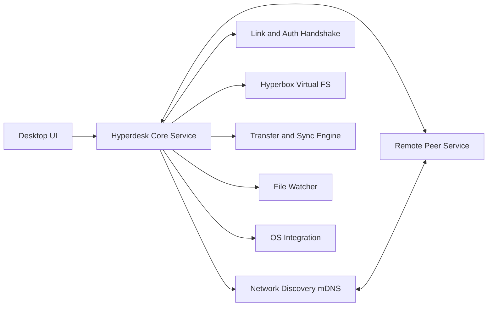
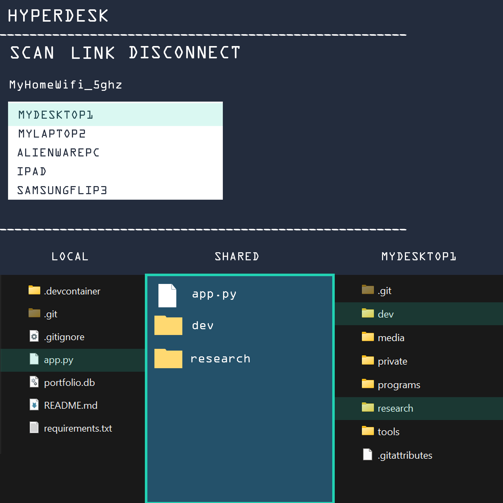
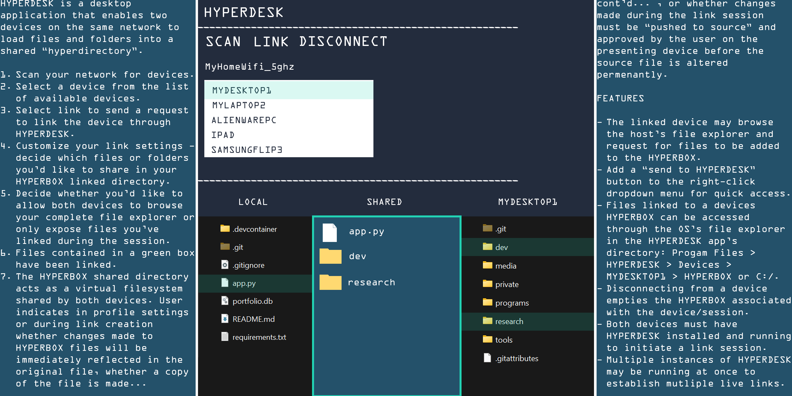

# HYPERDESK Project Overview

## Concept summary
HYPERDESK is a desktop application that links two devices on the same network and exposes a shared "hyperbox" directory for controlled, session-based file sharing. The host can choose what to expose, and the linked device can request files or push changes based on permissions.

## Core user flow
1. Scan the network for devices.
2. Select a device and send a link request.
3. Configure link settings (folders, read/write mode, approval rules).
4. Use the hyperbox to browse or request files.
5. Approve requests and manage transfers.
6. Disconnect to end the session and clear the hyperbox.

## Feature targets (from concept)
- Device discovery and link requests
- Per-session hyperbox virtual filesystem
- Configurable share modes: mirror, copy, or approval-based push
- Optional full file explorer access vs scoped share
- OS file explorer integration ("Send to HYPERDESK" context action)
- Multi-session support and session dashboards
- Transfer log with audit history and session persistence

## Development strategy
- Phase 0: Spec and UX validation (permission modes, conflict rules, safety).
- Phase 1: MVP core (discovery, link/auth, hyperbox mapping, transfer engine, basic UI).
- Phase 2: Reliability and security (encryption, audit log, retries, conflict resolution).
- Phase 3: OS integration (context menu, virtual folder, installers).
- Phase 4: Multi-session scaling, performance tuning, cross-platform polish.

## Implementation strategy
Full plan: `./implementation_strategy.md`

## Language and stack decision (MVP)
- Python for core logic and networking (fast iteration, rich libraries).
- PySide6 for a native desktop UI.
- Asyncio + websockets for session transport.

Production-ready options to evaluate after MVP:
- Rust for the transfer engine and sync core (performance, safety).
- Tauri (Rust + web UI) or C#/.NET (Windows-first) for UI/packaging.

Decision: start in Python + PySide6 for speed, but keep service boundaries so the core can be replaced with Rust or .NET later.

## Architecture

## Current stage
MVP scaffold includes a dedicated request queue view with filters/CSV export, approvals tied to transfer jobs, transfer settings UI with enforced throttling, SQLite persistence, hyperbox auto-sync rules with conflict handling, optional mDNS discovery, session tokens and sync rules with device presets, peer client file reception with checksum ack and progress reporting, transfer log footer stats, and a bandwidth history chart.

## Reference images
### Initial concept

### Additional wireframes (generated)

